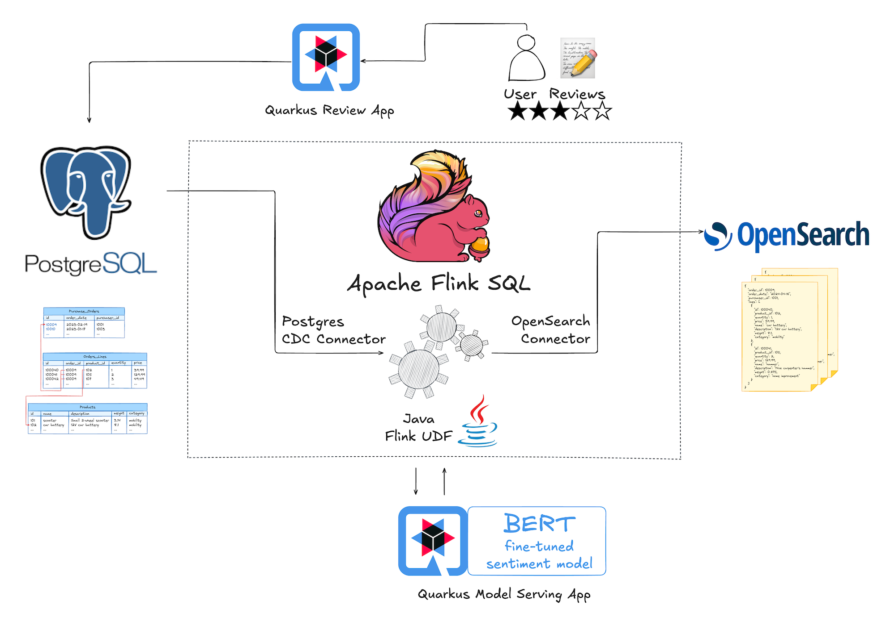

## Local Infra Setup

The hands-on lab infra is all running locally in containers and requires [Docker Compose](https://docs.docker.com/compose/).



> NOTE
>
> If you could not pull the container images before the lab,
> and pulling via the remote network through conference wifi takes too long,
> you can try out these fall-back options:
>
> * Tether with your phone (preferred; download volume is ~5 GB)
> * [Using the local lab container registry](lab_image_registry.md)
> * [Using the USB sticks](lab_image_drive.md)

In the root folder of this repository run

```bash
docker compose up
```

This will pull and launch several containers based on the following images:

**1. Upstream container images:**

* docker.io/flink:1.19.1-scala_2.12-java17
* docker.io/opensearchproject/opensearch:1.3.19
* quay.io/debezium/example-postgres:2.7.3.Final
* quay.io/debezium/tooling:latest

**2. Lab specific custom container images:**

* docker.io/hpgrahsl/hol-devoxxbe-model-serving-app:1.0.0
* docker.io/hpgrahsl/hol-devoxxbe-review-app:1.0.1
* docker.io/hpgrahsl/data-generator:1.1.4

After pulling, you're expected to see 7 containers successfully up and running which you can list by typing `docker ps`:

```
CONTAINER ID   IMAGE                                           COMMAND                  CREATED         STATUS         PORTS                                                                NAMES
ef66e7ee2c43   hpgrahsl/hol-devoxxbe-review-app:1.0.1          "/opt/jboss/containe…"   2 minutes ago   Up 2 minutes   8443/tcp, 0.0.0.0:9091->8080/tcp                                     hol-devoxxbe-review-app-1
02b17e939f4c   flink:1.19.1-scala_2.12-java17                  "/docker-entrypoint.…"   2 minutes ago   Up 2 minutes   6123/tcp, 8081/tcp                                                   hol-devoxxbe-taskmanager-1
9f02cd047305   flink:1.19.1-scala_2.12-java17                  "/docker-entrypoint.…"   2 minutes ago   Up 2 minutes   6123/tcp, 8081/tcp                                                   hol-devoxxbe-sql-client-1
d33ed9d76795   flink:1.19.1-scala_2.12-java17                  "/docker-entrypoint.…"   2 minutes ago   Up 2 minutes   6123/tcp, 0.0.0.0:8081->8081/tcp                                     hol-devoxxbe-jobmanager-1
8df98b3f9d01   quay.io/debezium/example-postgres:2.7.3.Final   "docker-entrypoint.s…"   2 minutes ago   Up 2 minutes   0.0.0.0:5432->5432/tcp                                               hol-devoxxbe-postgres-1
c68e633a33bb   opensearchproject/opensearch:1.3.19             "./opensearch-docker…"   2 minutes ago   Up 2 minutes   0.0.0.0:9200->9200/tcp, 9300/tcp, 0.0.0.0:9600->9600/tcp, 9650/tcp   opensearch-node1
135df910cc63   hpgrahsl/hol-devoxxbe-model-serving-app:1.0.0   "/opt/jboss/containe…"   2 minutes ago   Up 2 minutes   8443/tcp, 0.0.0.0:9090->8080/tcp                                     hol-devoxxbe-model-serving-app-1
```

With all that out of the way, it’s about time to get your hands dirty and begin the [first lab module](./module_01.md) to start working with Apache Flink and Flink SQL.
